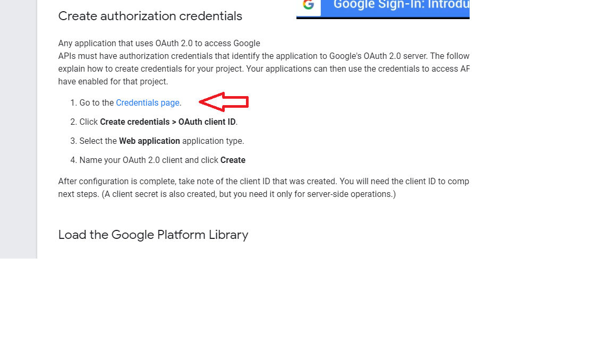
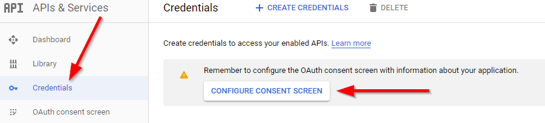
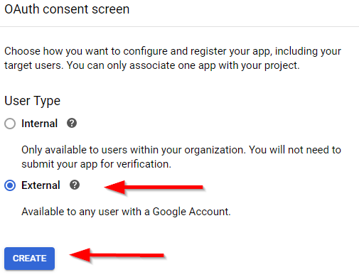
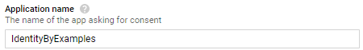
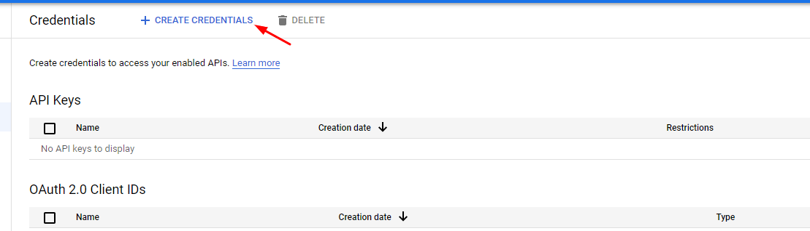
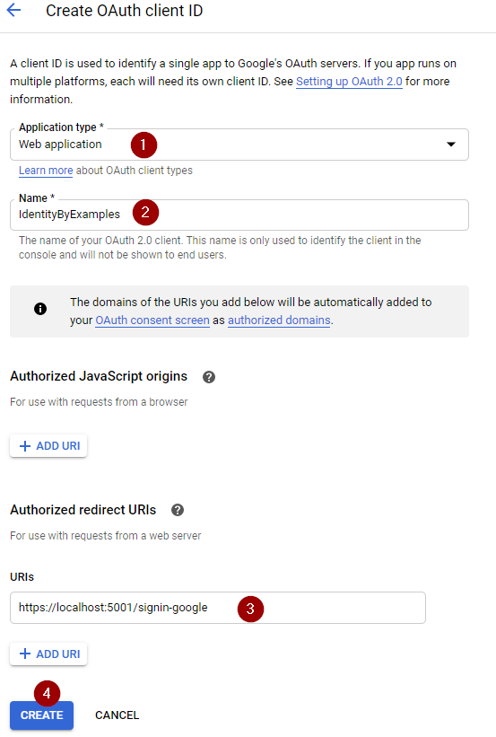

# Google API Platforma

Otvorimo [Google Console](https://console.cloud.google.com/apis/credentials) gde mozemo procitati malo vise o Googel OAuth servisu.

**Na sredini stranice se nalazi "Credentials page" dugme.**

**Pod Credentials, moramo konfigurisati "consent screen" (slika ispod):**
 

**Izabrati "External user":** \

**Upisati ime aplikacije i proci ostale korake** \

**Kreiramo credentials i izaberemo OAuth client ID:**

**Sada mozemo izabrati Application Type, Ime i redirect URIs za aplikaciju**

