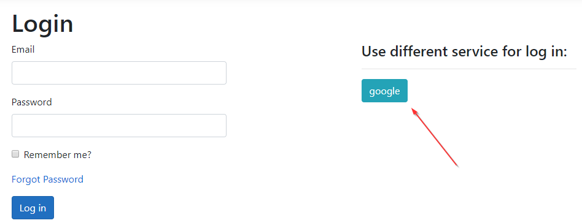

# Konfiguracija eksternog identity provider-a (Google)

* Sada cemo registorvati Google kao eksterni identity provajder. Da bi to uradili moramo instalirati paket, preko nuget package manager-a.
  ```
  Microsoft.AspNetCore.Authentication.Google
  ```

* Posle instalacije modifikujemo ```appsettings.json``` fajl.
  ```
  "Authentication": {
      "Google": {
        "ClientId": "<upisati svoj client ID>",
        "ClientSecret": "<upisati svoj client sectet>"
      }
    }
  ```

* Sada cemo konfigurisati Google kao eksterni provajder tako sto cemo modifikovati ```ConfigureServices``` metodu unutar ```Startup.cs``` fajla:
  ```
  services.AddAuthentication()
      .AddGoogle("google", opt =>
      {
          var googleAuth = Configuration.GetSection("Authentication:Google");
          opt.ClientId = googleAuth["ClientId"];
          opt.ClientSecret = googleAuth["ClientSecret"];
          opt.SignInScheme = IdentityConstants.ExternalScheme;
      });
  ```

  ```AddAuthentication``` metoda dozvoljava konfigurisanje drugog identity provajdera kao sto je Google, Facebook, Twitter itd...\
  ```AddIdentity``` metoda konfigurise podrazumjevane postavke, pa zbog toga ```AddAuthentication``` se mora dodati ispod ove metode.

* Sledeci korak je kreiranje ```View/Shared/_ExternalAuthentication.cshtml``` partial view, da podrzava externu autentifikaciju
  ```
  @using Microsoft.AspNetCore.Identity
  @using IdentityByExamples.Models

  @inject SignInManager<User> SignInManager

  <div class="col-md-4 offset-2">
      <section>
          <h4>Use different service for log in:</h4>
          <hr />
          @{
              var providers = (await SignInManager.GetExternalAuthenticationSchemesAsync()).ToList();
              if (!providers.Any())
              {
                  <div>
                      <p>
                          We couldn't find any external provider
                      </p>
                  </div>
              }
              else
              {
                  <form asp-action="ExternalLogin" asp-route-returnurl="@ViewData["ReturnUrl"]" method="post" class="form-horizontal">
                      <div>
                          <p>
                              @foreach (var provider in providers)
                              {
                                  <input type="submit" class="btn btn-info" value="@provider.Name" name="provider" />
                              }
                          </p>
                      </div>
                  </form>
              }
          }
      </section>
  </div>
  ```
  Sa ```SignInManager.GetExternalAuthenticationSchemesAsync``` metodom, povucemo sve registrovane provajdere u nasoj aplikaiji i ako nadje, prkaze ih na stranici.
  
  
  Sada cemo kreirani partial view ukljuciti ```Login``` stranicu
  ```
  <div class="col-md-4">
    <form asp-action="Login" asp-route-returnUrl="@ViewData["ReturnUrl"]">
          //code removed for clarity reasons  
    </form>
  </div>
  <partial name="_ExternalAuthentication" />
  ```
  
* Kada posjetimo login stranicu trebalo bi da izgleda ovako
  
  
 Sada prelazimo na [implementaciju Google Indentity Provider-a](./ImplementacijaEksternogIdentityProvider.md)

